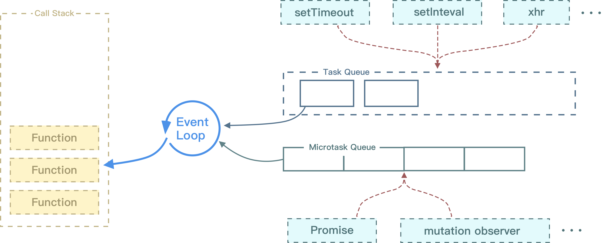

[题目链接](https://zhuanlan.zhihu.com/p/25407758)



## 0. 基本操作

```js
for(var i = 0; i < 5; i ++) {
    console.log(i);
}
```

```js
for (var i = 0; i < 5; i++) {
    setTimeout(function () {
        // 但凡这里代码执行的时候，i 已经变成了 5
        console.log(i);
    }, 1000 * i);
}
```

```js
for (var i = 0; i < 5; i++) {
    (function (i) {
        setTimeout(function () {
            console.log(i);
        }, i * 1000);
    })(i);
}
```

```js
for (var i = 0; i < 5; i++) {
    (function () {
        setTimeout(function () {
            console.log(i);
        }, i * 1000);
    })(i);
}
```

```js
for (var i = 0; i < 5; i++) {
    setTimeout((function (i) {
        console.log(i);
    })(i), i * 1000);
}
```

## 1. 小试牛刀

```js
setTimeout(function () {
    console.log(1)
}, 0);

new Promise(function executor(resolve) {
    console.log(2);
    for (var i = 0; i < 10000; i++) {
        i == 9999 && resolve();
    }
    console.log(3);
}).then(function () {
    console.log(4);
});
console.log(5);
```

## 2. 任务队列

浏览器常见（Node 会有差异）

宏任务：setTimeout、setInterval、DOM 事件回调、AJAX

微任务：Promise 回调、MutationObserver

一句话：执行宏任务期间，若产生微任务队列，等当前微任务队列执行完毕后，再去执行下一个宏任务以及所产生的微任务队列！

执行顺序：同步 -> 微 -> 宏

<font size=2 color=#ccc>注：为了方便理解，这里并没有把 script 标签当作宏任务去说</font>

## 3. 测试测试

```js
setTimeout(() => {
    new Promise(resolve => {
        resolve();
    }).then(() => {
        console.log('test');
    });

    console.log(4);
});

new Promise(resolve => {
    resolve();
    console.log(1)
}).then(() => {
    console.log(3);
    Promise.resolve().then(() => {
        console.log('before timeout');
    }).then(() => {
        Promise.resolve().then(() => {
            console.log('also before timeout')
        })
    })
})
console.log(2);
```

## 4. 变态测试

```js
setTimeout(() => {
    new Promise(resolve => {
        resolve();
    }).then(() => {
        console.log('test');
    });

    console.log(4);
    // #1
    setTimeout(function () {
        Promise.resolve().then(res => {
            console.log(444);
        })
    })
    Promise.resolve().then(res => {
        console.log(888);
    })
});

new Promise(resolve => {
    resolve();
    console.log(1)
}).then(() => {
    console.log(3);
    // #2
    setTimeout(function () {
        Promise.resolve().then(() => {
            console.log('before timeout');
        }).then(() => {
            Promise.resolve().then(() => {
                console.log('also before timeout')
            })
        })
    })
})
console.log(2);
```

## 5. 其他题目

```js
setTimeout(() => {
    console.log(1);
});

Promise.resolve().then(() => {
    console.log(2);
});

Promise.resolve().then(() => {
    console.log(4);
});
console.log(3);
```

```js
setTimeout(function () {
    console.log(1);
});
new Promise(resolve => {
    console.log(2);
    resolve();
}).then(() => {
    console.log(3);
}).then(() => {
    console.log(4);
});
console.log(5);
```

```js
const first = () => new Promise((resolve, reject) => {
    console.log(3);

    let p = new Promise((resolve, reject) => {
        console.log(7);

        setTimeout(() => {
            console.log(5);
            resolve(6);
        });

        resolve(1);
    });

    resolve(2);

    p.then(arg => {
        console.log(arg);
    });
});

first().then(arg => {
    console.log(arg);
});
console.log(4);
```

## 6. 最后一两个

```js
Promise.resolve().then(() => {
    // #1
    console.log(1);
    Promise.resolve().then(r => {
        // #3
        console.log(3);
    }).then(r => {
        console.log(4);
    });
    // #mark
}).then(r => {
    // #2
    console.log(2);
});
```

```js
Promise.resolve().then(() => {
    Promise.resolve().then(r => {
        // #1
        console.log(1);
    }).then(r => {
        // #3
        console.log(3);
    }).then(r => {
        // #5
        console.log(5);
    });
    // #mark
}).then(r => {
    // #2
    console.log(2);
}).then(() => {
    // #4
    console.log(4)
});
```

## 7. 大结局

```js
setTimeout(function() {
    console.log(0);
});


new Promise((resolve, reject) => {
    console.log(1);
    resolve();
}).then(() => {
    // 执行此微的时候又会产生两个微
    console.log(2);
    new Promise((resolve, reject) => {
        console.log(3);
        resolve();
    }).then(() => {
        console.log(4);
    }).then(() => {
        console.log(5);
    });
}).then(() => {
    console.log(6);
});

new Promise((resolve, reject) => {
    console.log(7);
    resolve();
}).then(() => {
    console.log(8);
});
```

## 8. 大大结局

```js
function func(num) {
    return function () {
        // #1
        console.log(num)
    };
}
setTimeout(func(1));

async function async3() {
    await async4();
    // #2
    console.log(8)
}
async function async4() {
    console.log(5)
}
async3();
function func2() {
    // #3
    console.log(2);
    async function async1() {
        await async2();
        // #6
        console.log(9)
    }
    async function async2() {
        console.log(5)
    }
    async1();
    setTimeout(func(4))
}
setTimeout(func2);

setTimeout(func(3));

new Promise(resolve => {
    console.log('Promise');
    resolve()
})
    // #4
    .then(() => console.log(6))
    // #5
    .then(() => console.log(7));
console.log(0);
```